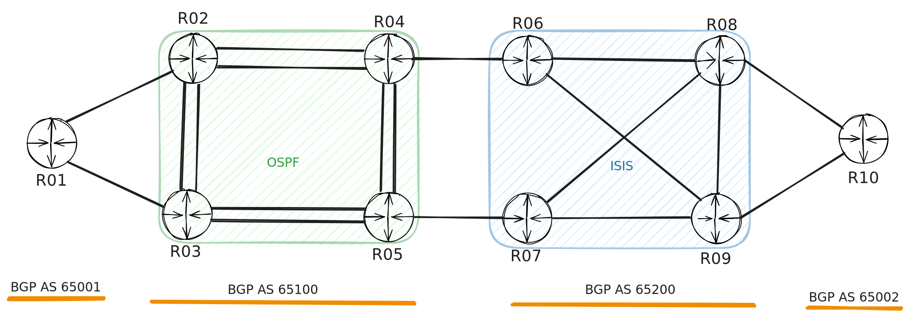

# NAF Workshop NUTS – Lab

Welcome to the lab repository for the **NAF Workshop NUTS**. This repository contains all necessary files to run and interact with the lab exercises.

You can **fork** this repository and either:
- Clone it locally on a Unix-based system, or
- Run it in [GitHub Codespaces](https://github.com/features/codespaces) for a browser-based environment.


## Setting Up Dependencies

### Option 1: Using [uv](https://github.com/astral-sh/uv)

We use [`uv`](https://github.com/astral-sh/uv) as our preferred Python dependency manager. To install all required dependencies, run:

```bash
uv sync
```

> You’ll need to have `uv` installed. Refer to the [uv installation guide](https://github.com/astral-sh/uv#installation).


### Option 2: Using [pip](https://pip.pypa.io/)

If you prefer not to use `uv`, you can install the dependencies using `pip`:

```bash
python3 -m venv .venv
source .venv/bin/activate
pip install -U pip
pip install -e .
```

> This installs the lab in editable/development mode.


### Option 3: Using the Dev Container

This repository includes a preconfigured [Dev Container](https://containers.dev/) (via `.devcontainer/`) which can be used with:

- [GitHub Codespaces](https://docs.github.com/en/codespaces)
- [Visual Studio Code](https://code.visualstudio.com/) with the [Dev Containers extension](https://marketplace.visualstudio.com/items?itemName=ms-vscode-remote.remote-containers)


## Lab Environment

The lab topology is built using:
- [`netlab`](https://netlab.tools/)
- [`containerlab`](https://containerlab.srlinux.dev/)

To reduce resource usage, the lab can be run using the [`NAPALM`](https://napalm.readthedocs.io/en/latest/) **mock driver** without starting any virtual devices.

If you prefer to run the full topology with containers, you need to:
1. Download and import the **Arista cEOS** container image.
2. Follow the guide at [netlab.tools/labs/ceos](https://netlab.tools/labs/ceos/) for setup instructions.


## Lab Topology

The following is a visual representation of the lab network:


